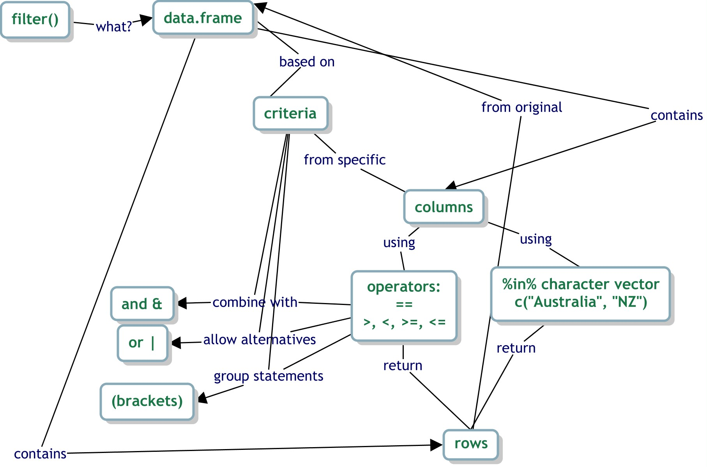
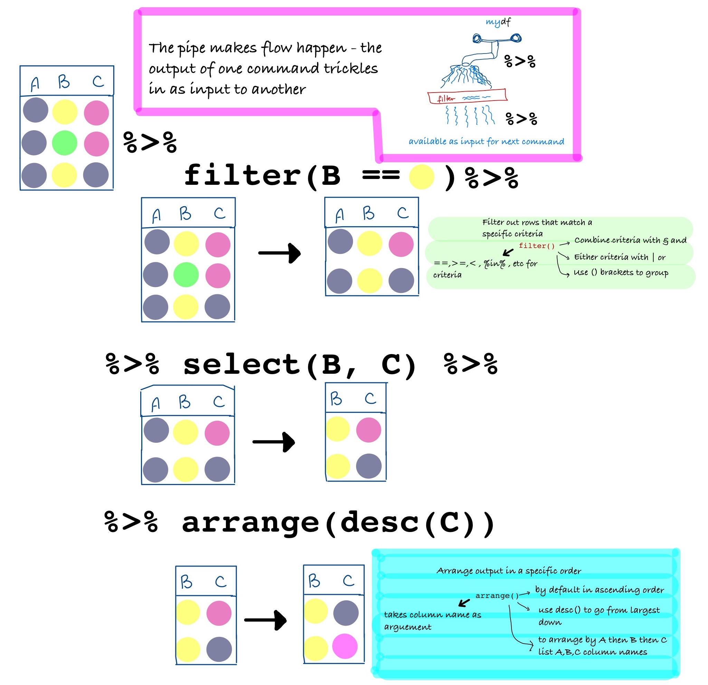
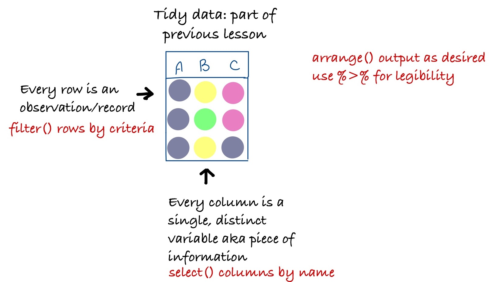

For the filtering section, which is what I would expect to get through in 15 minutes, a canonical concept map looks something like this:

***

The sketchnote/bigger picture I hope learners walk away from in this lesson is below. 

I have fleshed out the 

- `filter()` - green
- `%>%` - purple
- `arrange()` - cyan

Portions of the lesson.  I haven't fleshed out the `select()` section at this point, as whether to introduce things like `starts_with()` here or in another section needs to be taken in the context of the entire training plan. 

***

Ideally, I'd hope my learners would add the ideas shown in red to their global mental model (already existing things shown in black) of the tidyverse and tidy data/data wrangling in R.

